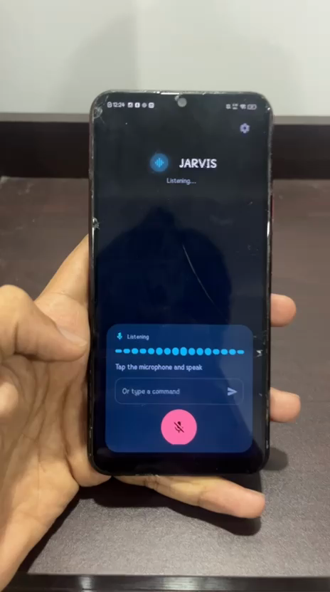
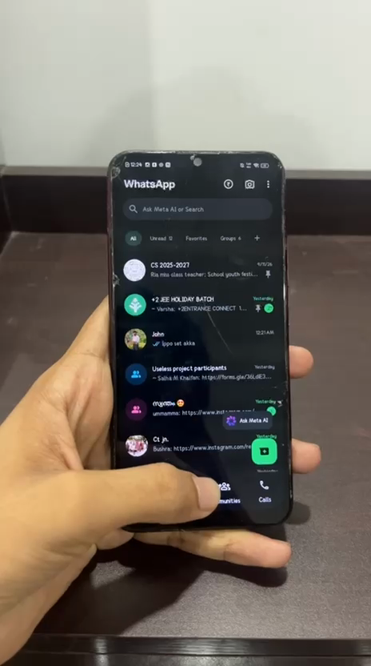
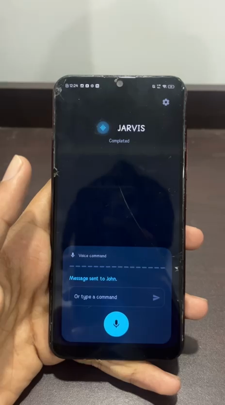
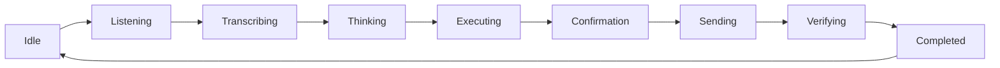

# Jarvis 🎯

## 📌 Basic Details
### 🏷️ Team Name: Jarvis

### 👥 Team Members
- 🥇 Team Lead: Muhammed Rilzan AM - Kunnamangalam Higher Secondary School

### 🧭 Mentor
Ahmed Shahabi

### 📝 Project Description
A useless and fun project for those who are lazy enough to open their phone and apps to send messages or to do any action in their smartphone, by allowing activation through voice commands. 😴🎙️📱

### 🫠 The Problem (that doesn't exist)
Unlocking the phone, finding the right app, tapping a chat, and typing a whole sentence is exhausting. 😩 Your thumbs deserve a vacation. 🏖️ Opening YouTube or WhatsApp with actual fingers is simply too much work.

### 🪄 The Solution (that nobody asked for)
Tap the mic 🎙️, speak like a slightly tired human, and let Jarvis do the tapping. ✨

1. 🗣️ On-device Android speech recognition turns your voice into text (not Whisper, not OpenAI).
2. 🧩 A local heuristic parser (or optional OpenAI, if you add a key later) turns that text into a command.
3. 📲 Jarvis finds the app, opens it, and — for WhatsApp — can type the message and ask before sending. ✅

**📌 N.B.** This is not an AI-required project right now. **No AI API token is needed to run the app.** 🚫🤖 The OpenAI token field in Settings is only for future updates. Voice-to-text is on-device Android speech recognition. OpenAI would only run *after* a transcript exists, to turn that text into a command. There is already a fallback that finds apps and matches simple phrases like `open WhatsApp` or `send … to …`. 🔍

### 🗑️ What we removed (version 1)
Our previous version had complete control over the device and activated just like Google Assistant — it invoked automatically on a “Hey Jarvis” 👋 voice message. We removed that feature because it crashed on small Android devices 💥 and needed a lot of restricted permissions to run smoothly.

See the [version 1 demo](https://gofile.io/d/z5UNkxkH) for how the old always-on build looked. 📼

## 🛠️ Technical Details
### 🧰 Technologies/Components Used
For Software:
- 💜 Kotlin
- 🎨 Jetpack Compose + Material 3
- 🎤 Android SpeechRecognizer (on-device voice-to-text)
- 🔊 Android Text-to-Speech
- ♿ AccessibilityService (WhatsApp tap / type / send)
- 🧠 Heuristic command parser + installed-app lookup
- 🔮 Optional OpenAI (OkHttp + kotlinx.serialization) — not required
- 💻 Android Studio / Gradle

## 🚀 Implementation
### 📥 Installation
Open this folder as a Gradle project in Android Studio, or skip building and install the APK below. 📦

Prefer a physical phone with WhatsApp installed. 📱 Emulators often lack Google speech recognition and real WhatsApp.

### ▶️ Run
1. 📦 Install the APK (or Run from Android Studio).
2. 🎤 Allow **Microphone**.
3. 🔓 Give Accessibility permission (required after sideloading):
   - **Settings → My apps → Jarvis → Allow restricted settings**
   - Then **Settings → Accessibility → Jarvis** and turn the service on
4. 🎙️ Tap the mic and speak, or type a command. Example: `Open WhatsApp and send “I will come tomorrow” to Rahul.`

Jarvis cannot secretly enable Accessibility. 🔒 On newer Android, sideloaded apps must get **Allow restricted settings** before the Accessibility toggle will appear.

OpenAI key in Settings is optional and unused unless you add one for future smarter parsing. 🔑

## 📚 Project Documentation

### 📸 Screenshots (Add at least 3)

*🎧 Home screen while Jarvis is listening — tap the mic and speak, or type a command.*

*💚 Jarvis opens WhatsApp after a voice command so you do not have to hunt for the icon.*

*✅ Done — confirmation that the WhatsApp message was sent.*

### 🗺️ Diagrams

*🔁 Voice state machine: listen on-device, parse the command (heuristic or optional AI), execute, confirm before send, then idle again.*

## 🎬 Project Demo

### 🎥 Video
[Final version — long demo](https://gofile.io/d/fagASq0l)

*Current Jarvis: voice command, open apps, send a WhatsApp message.* 🗣️📲💬

If Gofile does not open, use the [Google Drive fallback folder](https://drive.google.com/drive/folders/1633fZ8nAmVpHABdfjmw3RliFhVChsLxj?usp=sharing) (`Final version long video`). ☁️

### 🎞️ Additional Demos
- ⏱️ [Final version — short](https://gofile.io/d/aPjGGsXw) — quicker current-app clip
- 🕰️ [Version 1 / first version](https://gofile.io/d/z5UNkxkH) — old “Hey Jarvis” always-on build (removed)
- 📁 All three videos in one Gofile folder: https://gofile.io/d/VqnUM2J8
- ☁️ Drive fallback (videos + APK): https://drive.google.com/drive/folders/1633fZ8nAmVpHABdfjmw3RliFhVChsLxj?usp=sharing

### 📦 Download APK
- ⬇️ **Gofile:** https://gofile.io/d/sfA866Cu
- ☁️ **Fallback if Gofile does not work:** [Google Drive folder](https://drive.google.com/drive/folders/1633fZ8nAmVpHABdfjmw3RliFhVChsLxj?usp=sharing) (`app-debug.apk`)

Sideload the APK, enable unknown sources if asked, then **Settings → My apps → Jarvis → Allow restricted settings**, then **Settings → Accessibility → Jarvis**. 🔓

## 🙌 Team Contributions
- 🌟 Muhammed Rilzan AM: project owner — idea, implementation, demos
- 🧭 Mentor: Ahmed Shahabi

---
Made with ❤️ at TinkerHub Useless Projects

